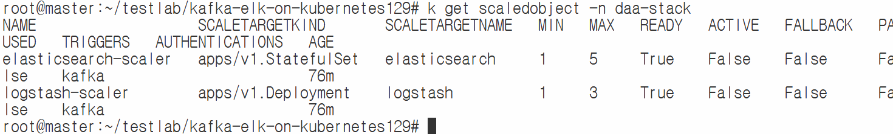
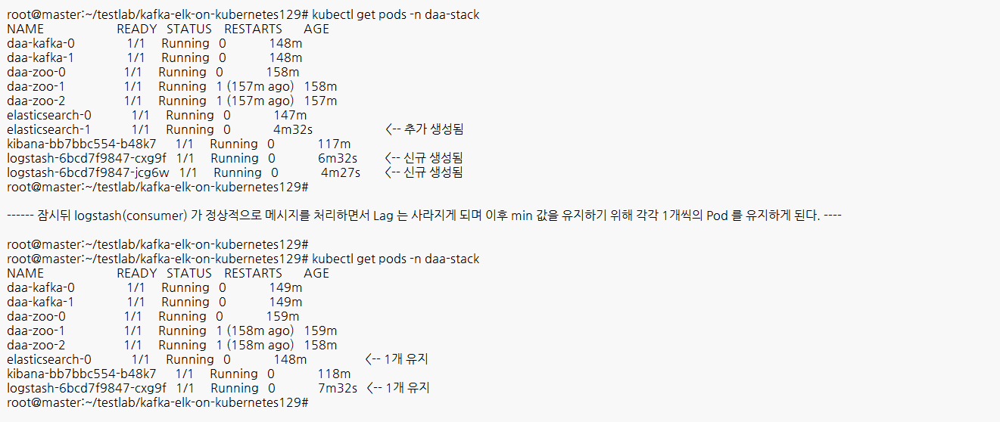

##### 본 실습은 kubeadm 으로 k8s 1.29 가 구성되어 있는 환경에서 실습 진행함 #####
1) run time : cri-dockerd  
2) master : 172.16.8.10, worker1,2,3 : 172.16.8.11, 172.16.8.12, 172.16.8.13 (NAT)  
3) metallb 구축되어 있음 > iprange : 172.16.8.201 ~ 172.16.8.239  
4) master 노드에 nfs 서버 구축되어 있으며 /k8s 디렉토리를 공유 디렉토리로 사용(777)  
- master : apt install -y nfs-server nfs-common  
- worker : apt install -y nfs-common  

##### 시작할 때 'kubectl create namespace daa-stack' 로 네임 스페이스 생성 #####

##### 01-zookeeper.yaml #####

kubectl apply -f 01-zookeeper.yaml > ZooKeeper 서비스 및 StatefulSet 생성  
kubectl get pods -n daa-stack -w > 3개 파드가 모두 1/1 Running이 되는지 확인  
kubectl logs daa-zoo-0 -n daa-stack > 로그 끝에 QuorumPeer가 보이면 정상  

##### 02-kafka.yaml #####

kubectl apply -f 02-kafka.yaml > Kafka 서비스 및 StatefulSet 생성  
kubectl logs daa-kafka-0 -n daa-stack > KafkaServer id=0 started 메시지 확인  
kubectl exec -it daa-kafka-0 -n daa-stack -- kafka-topics.sh --create --topic my-topic --bootstrap-server localhost:9092 > 테스트용 토픽 생성  

##### 03-elk.yaml #####

kubectl apply -f 03-elk.yaml > "ES, Kibana 배포 및 외부 서비스 노출"  
kubectl get svc -n daa-stack > "elasticsearch-lb, kibana-svc의 EXTERNAL-IP 확인"  

curl http://[ES-EXTERNAL-IP]:9200 

##### 04-logstash.yaml #####

kubectl apply -f 04-logstash.yaml > Logstash 설정 및 배포  
kubectl logs -f deployment/logstash -n daa-stack > Pipeline started 및 Successfully joined group 확인

##### 전체 동작 상태 검증 #####

kubectl exec -it daa-kafka-0 -n daa-stack -- \  
kafka-console-producer.sh --topic my-topic --bootstrap-server localhost:9092  

메시지 입력 예: {"msg": "hello cloud"}

브라우저에서 http://[KIBANA-IP]:5601 접속.  
Index Pattern 생성: kafka-app-log-*  
Discover 메뉴: 실시간으로 들어오는 로그 확인.  

재시작이 필요할 때: kubectl rollout restart statefulset [이름] -n daa-stack  
데이터 초기화: kubectl delete pvc --all -n daa-stack (주의: NFS의 실제 데이터도 삭제될 수 있음)  

#### 카프카와 KEDA 를 이용한 Lag 처리 ####
##### helm, keda 설치 #####
snap install helm --classichelm repo add kedacore https://kedacore.github.io/charts  
helm repo add kedacore https://kedacore.github.io/charts  
helm repo update  
helm repo ls  
helm install keda kedacore/keda -n keda --create-namespace  
kubectl get po -n keda  
  
#####  logstash 구성(파드마다 고유한 client_id 를 갖도록 기존 파일에 환경변수[POD_NAME] 설정 추가 #####
kubectl apply -f 04-logstash.yaml , 파드 이름을 환경 변수 POD_NAME 에 할당하도록 코드 수정  

##### KEDA 구성을 위한 ScaledObject 생성 #####
kafka 이 Lag이 10개가 되면 자동으로 logstash, elastichsearch 를 최대 각 3, 5개로 늘어나도록 설정

kubectl apply -f 05-keda-scaler.yaml  
k get scaledobject -n daa-stack  

##### 테스트 진행 #####
Kafka에서 Lag은 **"생성된 메시지 양(Log End Offset)과 처리된 메시지 양(Current Offset) 사이의 차이"**를 의미  
Log End Offset (LEO): 프로듀서가 토픽에 넣은 마지막 메시지의 번호  

Current Offset: 컨슈머(여기서는 Logstash)가 마지막으로 읽어서 처리를 완료한 메시지의 번호  

Lag: LEO - Current Offset = 아직 처리되지 않고 큐에 쌓여 있는 메시지의 개수  

root@daa-kafka-0:/# # 컨슈머 그룹 상태 및 Lag 확인  
kafka-consumer-groups.sh --bootstrap-server localhost:19092 --group logstash-group --describe

내부적으로 메시지를 발생 시키더라도 서버의 성능이 나쁘지 않다면 LAG 이 발생되지 않을 수 있다.

따라서 본 실습에서는 logstash 의 개수를 조정하기 위해   
1) 04-logstash.yaml 파일에서 deployment 의 replicas 를 먼저 0 으로 조정하고 apply 한다.  
2) kubectl get pods -n daa-stack -w 으로 실시간으로 logstash, elasticsearch 의 개수를 확인한다  
3) 새로운 터미널을 열고    

root@master:~/testlab/kafka-elk-on-kubernetes129# kubectl exec -it daa-kafka-0 -n daa-stack -- /bin/bash    # 컨테이너로 들어간다  
root@daa-kafka-0:/# for i in {1..100}; do   echo "log-message-$i" | kafka-console-producer.sh   --bootstrap-server daa-kafka-0.daa-kafka-hs:19092   --topic my-topic; done   # 메시지를 발생 시킨다.  

